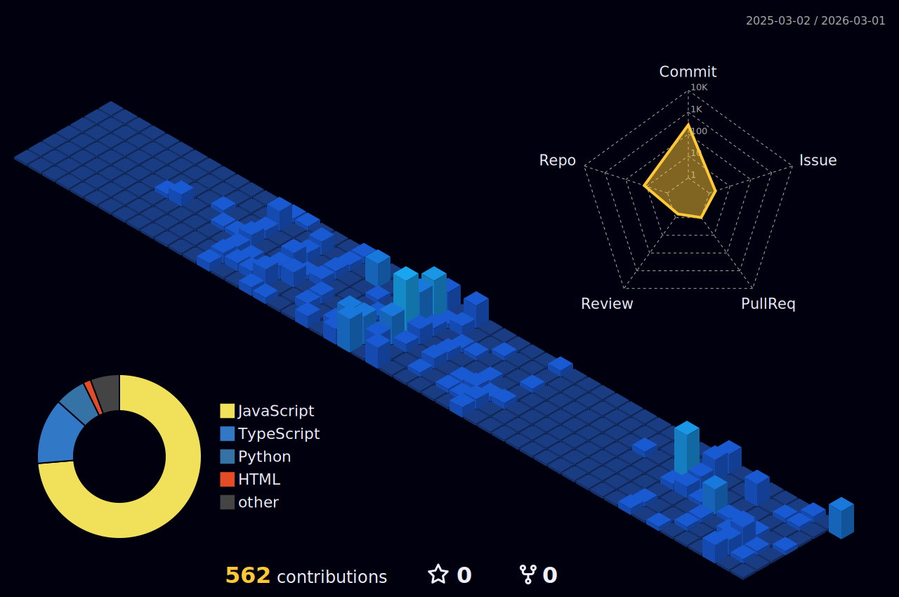

[//]: # (  )

  

  <table style="border: none;">
    <tr>
      <td width="60%" style="vertical-align: top;">
        <h3 align="left">🚀 About me</h3>
        

          I'm a Developer passionate about <b>automation</b>, <b>Python</b>, and building efficient systems.  
          With a focus on <b>clean code</b> and <b>modern architectures</b>, I'm constantly seeking to transform complex ideas into scalable solutions.
        

      </td>
      <td width="40%" style="vertical-align: top;">
        <h3 align="left">📬 Connect with me</h3>
        

           
           
          
        

      </td>
    </tr>
  </table>

---

### 🛠 Tech Stack & Expertise

- **Languages & Frameworks:** Python, JavaScript (ES6+), React, Node.js, C#, ASP.NET Core
- **Databases:** MySQL, PostgreSQL, SQL Server
- **DevOps & Cloud:** Docker, Linux (Ubuntu/Debian), Git, GitHub Actions, CI/CD Pipelines
- **Architectures:** RESTful APIs, Microservices, Asynchronous Messaging
- **Testing & Quality:** Unit Testing, Integration Testing, Code Reviews, Static Analysis
- **Tools & Practices:** Postman, CI/CD, Test-Driven Development (TDD), Clean Code Principles
- **Other Skills:** Automation, System Design, Performance Optimization, Code Reviews, Open Source Contribution

[//]: # ([![My Skills]&#40;https://skillicons.dev/icons?i=js,ts,css,tailwind,react,nodejs,py,cs,dotnet,mysql,postgres,sqlite,postman,docker,linux,bash,git,github,figma,sentry&theme=dark&perline=10&#41;]&#40;https://skillicons.dev&#41;)

  

---

### 📈 What I Do

- Design and implement **automation workflows** and **web applications**
- Optimize **database performance** and **system reliability**
- Build **scalable back-end services** and **interactive front-end interfaces**
- Deliver **clean, secure, and maintainable** software solutions

---

### 📚 Highlights

- Passionate about **clean architecture**, **automation**, and **continuous learning**
- Experienced in **fullstack development** and **system integration**
- Dedicated to building **open-source projects** and contributing to the tech community

---

### 📊 GitHub Stats

  
  

   

  
  

[//]: # (![svg]&#40;./profile-3d-contrib/profile-night-view.svg&#41;)

  

